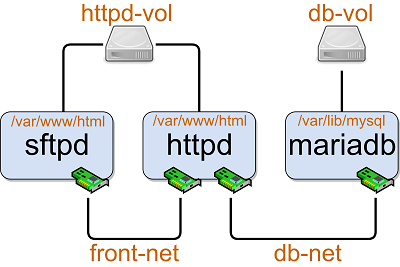

# 'Docker: Inception' Training Course Labs
> You can download lab supporting materials with the following command:
```shell extension
$ git clone https://github.com/aydarsh/DockerInceptionLabs.git
$ cd DockerInceptionLabs/
```

## testjava
ENTRYPOINT and CMD directives are used here.
When ENTRYPOINT is used, then that command will be executed.
CMD shows default arguments, that can be overriden.

Have a look at the application run results:
```shell extension
$ sudo docker image build -t quadraticequation:1.0 .
$ sudo docker container run --rm quadraticequation:1.0
$ sudo docker container run --rm quadraticequation:1.0 1 2018 -2019
$ sudo docker container run --rm quadraticequation:1.0 1 2 a
$ sudo docker container run --rm quadraticequation:1.0 1 2
$ sudo docker container run --rm quadraticequation:1.0 0 2 -2
```

## projecteuler.net
This is a Ruby script that does not require an installation of any additional library, so there is no need for a custom built image.

You can run this script in the following way:
```shell extension
$ sudo docker container run --rm -v "$PWD":/usr/src/myapp ruby ruby /usr/src/myapp/problem10.rb
```

## testsftp
This Ruby script lists files from a remote sftp server. And this script requires net-sftp library, that is why it's reasonable to build a new image with net-sftp library installed.

Build this image and run a new container and see results:
```shell extension
$ sudo docker image build -t testsftp:1.0 .
$ sudo docker container run --rm testsftp:1.0
```

## testlamp
Here in this lab a LAMP stack is built. 

[Debian **L**inux](https://store.docker.com/images/debian) is used as base image,  
[The **A**pache HTTP Server](https://store.docker.com/images/httpd) is a web server,  
[**M**ariaDB Server](https://store.docker.com/images/mariadb) is a database server,  
[**P**HP](https://store.docker.com/images/php) handles web pages.  

In addition to the images listed above, [SFTP Server](https://store.docker.com/community/images/atmoz/sftp) is used here. Also, this lab features [volumes](https://docs.docker.com/storage/volumes/) and [user-defined bridge networks](https://docs.docker.com/network/bridge/).

This is the diagram of our LAMP stack:  
  

Let's see how this works:

Firstly, we create named volumes and user-defined bridge networks:
```shell extension
$ cd testlamp/
$ sudo docker network create -d bridge db-net
$ sudo docker network create -d bridge front-net
$ sudo docker volume create db-vol
$ sudo docker volume create httpd-vol
```

PHP here needs `mysqli` extension to use MariaDB, so a new image with this extension is built:
```shell extension
$ sudo docker image build -t php_mysqli:apache .
```

After that a new apache container is run. This container is connected to both front-net and db-net networks. Also the volume httpd-vol is mounted into this container's /var/www/html directory:
```shell extension
$ sudo docker container run -d -p 8080:80 --name my-httpd --network front-net --mount type=volume,source=httpd-vol,destination=/var/www/html php_mysqli:apache
$ sudo docker network connect db-net my-httpd
```

Files for the apache server are copied to the httpd-vol via sftp. The sftp server can be setup in the following way. This container is connected to the front-net network and the httpd-vol is mounted to the /var/www/html directory:
```shell extension
$ sudo docker container run -d -p 2002:22 --name my-sftpd --hostname my-sftpd --network front-net --mount type=volume,source=httpd-vol,destination=/var/www/html atmoz/sftp sftpuser:sftpuser
$ sudo docker container exec -ti my-sftpd bash
root@my-sftpd> userdel -r sftpuser
root@my-sftpd> passwd www-data  ## inception
root@my-sftpd> exit
```
> You can now try this sftpd:httpd pair setup. In order that, download file [index.php](testlamp/index.php) from the `testlamp` directory onto your Desktop. Then, use WinSCP (or any other sftp client app) with the following credentials:
```
Host name: \<your-docker-host-IP\>
Port: 2002
User name: www-data
Password: inception
```
> After that, copy `index.php` into the `html` directory.
> Now open in your browser `http://<your-docker-host-IP>:8080`. You should see a greeting message in your browser now.

Now let's setup database. This container is connected to the db-net network, its port is not exposed to the Internet, so the database is not available from the Internet, but it's available within the db-net network. The apache server is connected to the db-net network, so it can reach the database:

```shell extension
$ sudo docker container run -d --name my-mariadb --hostname my-mariadb --network db-net --mount type=volume,source=db-vol,destination=/var/lib/mysql -e MYSQL_ROOT_PASSWORD=inception mariadb
$ sudo docker container exec -ti my-mariadb bash
root@my-mariadb> mysql -u root -p  ## inception
mariadb> create database ourdb;
mariadb> use ourdb;
mariadb> create table staff (
-> id int not null auto_increment,
-> name varchar(50),
-> email varchar (100),
-> company varchar(100),
-> primary key (id)
-> );
```
The values shown below can be inserted into the database:
> No worries about personal data. These records are from random data generators.
```shell extension
mariadb> insert into staff (name, email, company) values
-> ("Nicholas","ultrices.posuere@aliquetsemut.edu","Consectetuer Industries"),
-> ("Rachel","sapien.Aenean.massa@quis.net","Cum Sociis Natoque Ltd"),
-> ("Urielle","faucibus.Morbi@Quisquenonummy.ca","Vitae Posuere Corp."),
-> ("Jescie","scelerisque.mollis.Phasellus@Praesentinterdumligula.com","Placerat Limited"),
-> ("Bianca","ac@loremvitaeodio.co.uk","Et Arcu Foundation");
mariadb> select * from staff;
```
Additional steps for securing database are performed below:
```shell extension
mariadb> use mysql;
mariadb> grant all privileges
-> on ourdb.*
-> to 'db_user'@'localhost'
-> identified by 'inception';
mariadb> grant all privileges
-> on ourdb.*
-> to 'db_user'@'%'
-> identified by 'inception';
mariadb> exit;
root@my-mariadb> mysql_secure_installation
root@my-mariadb> exit
```

Now that we have configured our LAMP stack, we can check it. To perform that, download files [samplepage.php](testlamp/samplepage.php) and [dbinfo.inc](testlamp/dbinfo.inc) from the `testlamp` directory onto your Desktop and copy them with WinSCP into the `html` directory. 

Now open in your browser `http://<your-docker-host-IP>:8080/samplepage.php`. You should see the list of staff in your browser now. 

Great job!


